<p align="center">
  
</p>

<p align="center">
  
  
</p>

<h1 align="center">Murat Ferhat Derya</h1>
<p align="center">
  <strong>Software Engineer building AI-powered systems</strong><br />
  Backend-heavy full-stack development · LLM applications · data systems
</p>
<p align="center">
  <a href="https://github.com/Feddyhub">GitHub</a> ·
  <a href="https://www.linkedin.com/in/muratferhatderya/">LinkedIn</a>
</p>

---

### 01 / player.log

I build software around backend systems, data, and AI. My work often crosses the boundary between an API and the pipeline behind it: structuring source data, retrieving the right context, integrating a model or tool, and building the interface that makes the result usable.

```text
main_quest     → useful, reliable AI-powered software
current_focus  → backend engineering · RAG · local LLMs
working_style  → build, measure, simplify
```

### 02 / inventory

| Area | Tools I use |
| :--- | :--- |
| Backend | Python, FastAPI, Node.js, TypeScript, REST APIs |
| AI / LLM | RAG, semantic search, local LLMs, Ollama, OpenAI API, Claude API |
| Data | PostgreSQL, SQL, data preparation, analytics |
| Frontend | React, Next.js, Tailwind CSS |
| Infra | Docker, Linux, Git |
| Exploring | Tool calling, MCP, LLM evaluation, agent workflows |

### 03 / active quests

**[Hospital Laboratory Kiosk · local-first RAG](https://github.com/Feddyhub/hastane_RAG-codex)** <sub>private repository</sub>

A hospital laboratory information kiosk with a FastAPI backend and React interface. It normalizes institution-provided test data, matches names and abbreviations, and combines exact and semantic retrieval with local generation through Ollama. Validation and response boundaries keep answers tied to the source data; the intended runtime is local and offline after setup.

Elsewhere, my repositories cover AI applications, backend services, analytics, React interfaces, and experiments. [Browse all repositories →](https://github.com/Feddyhub?tab=repositories)

### 04 / save file

| | |
| :--- | :--- |
| Education | BSc Computer Science — Dokuz Eylül University |
| Graduate study | Management Information Systems — Muğla Sıtkı Koçman University |
| Industry | Previously Full-Stack Developer at Dativa AI; backend services, APIs, PostgreSQL, analytics, and frontend integration |
| Earlier work | Data science / LLM internship |
| Beyond the desk | Work & Travel in New Jersey, USA |

### 05 / contribution farm

<sub>Commits grow here. The snake handles harvesting.</sub>

<picture>
  <source media="(prefers-color-scheme: dark)" srcset="https://raw.githubusercontent.com/Feddyhub/Feddyhub/output/github-contribution-grid-snake-dark.svg" />
  <source media="(prefers-color-scheme: light)" srcset="https://raw.githubusercontent.com/Feddyhub/Feddyhub/output/github-contribution-grid-snake.svg" />
  
</picture>
